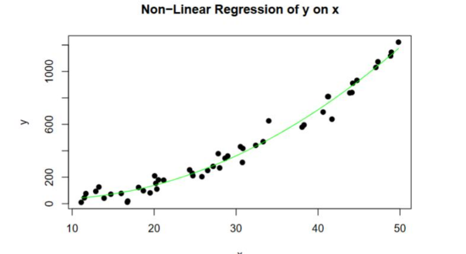

# Engineering Statistics R Studio Project

**Date**: April 2024  
**University**: University of Florida  

In this project, we culminated the skills developed during the semester by tackling a series of statistical challenges. The work involved applying various statistical techniques, including:

- Creating histograms to visualize data distribution
- Performing hypothesis testing to validate statistical assumptions
- Conducting regression analysis to identify relationships between variables

This project provided a hands-on opportunity to work with data and reinforced important statistical concepts and techniques, further enhancing my understanding of data analysis.

> *This project was completed as part of the coursework at the University of Florida.*

---

### Skills Utilized:
- **Statistical Analysis**: Hypothesis testing, regression analysis
- **Tools**: R, R Studio, Data Visualization
- **Key Concepts**: Data interpretation, statistical modeling, visualization
